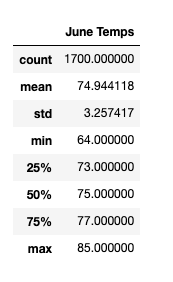
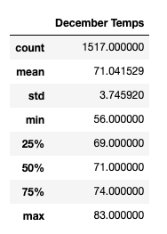

# Surfs Up
## Project Overview

The surf shop "Surfs Up" is looking to expand and Oahu, Hawaii is a possible location in owner’s radar. In addition to supplying surfing gear, the expansion would include an ice cream shop.

We already know that the average annual weather conditions on Oahu are favourable, but we want to know if operating the surf and ice cream business year-round is feasible.

There are concerns that the weather conditions in June and December pose a risk to operating all year, so let's look at the weather data in hawaii.sqlite.
Using an SQL Lite Viewer, we can see that the data comprises temperature and precipitation readings from January 1, 2010 to August 23, 2017. This will provide us with a reliable forecast for the months of June and December. Using SQLAlchemy, a Python SQL toolkit, and Object Relationship Manager, we'll go further into this data.

## Results

### According to June's temperature statistics
- The average temperature is 74.94 degrees
- Temperatures ranging from 64 to 85 degrees
- Temperatures reaching 77 degrees or more for around one week out of the month.

### According to December’s temperature statistics
- The average temperature is 71.04 degrees
- The temperature ranges from 56 to 83 degrees
- The temperature is 69 degrees or below for approximately one week out of the month.

## Summary

Historically, the weather in December and June has been relatively similar, although December has a broader range of outcomes, with a high that is similar to June's but a low that is much below June's.
The following are some other queries that could be run: The difference in precipitation between June and December is used to determine which month gets more rain.

Additional queries could be done, such as the difference in precipitation between June and July.
December to see which month has the most rain, as well as a comparison by month.
We may experience higher/lower temperatures and precipitation levels at the weather station, as we may see higher/lower temperatures and precipitation levels at in many locations We would be primarily interested in the weather station closest to our prospective location, which would help us limit down the results and offer us with the most useful information.
